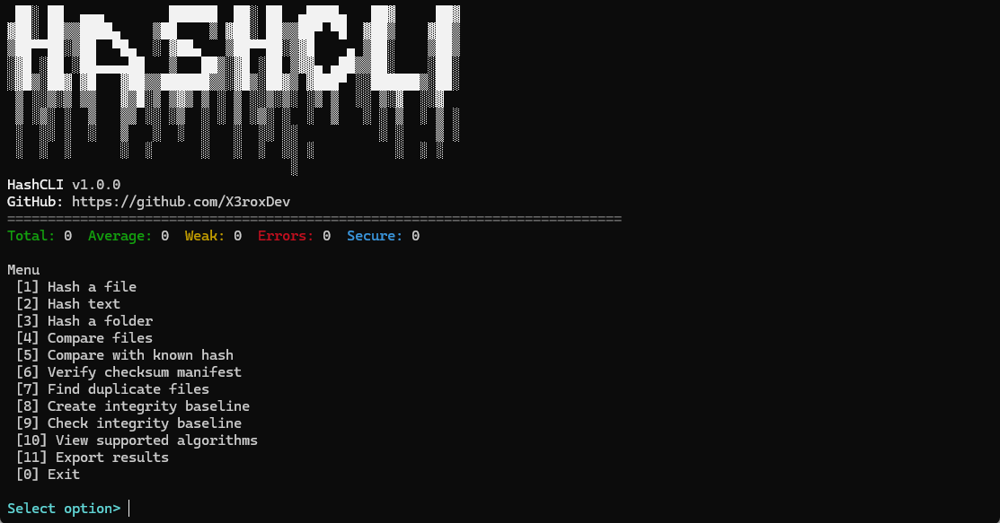

# HashCLI

Cross-platform terminal hash toolkit for files, text, folders, checksum verification, duplicate detection, and integrity baselines.



## Features

- Hash files, text, and folders
- Compare files or known hashes
- Verify checksum manifests
- Find duplicate files
- Create and check integrity baselines
- Export results to JSON, CSV, TXT, or checksum manifests
- Supports MD5, SHA-1, SHA-2, SHA-3, BLAKE2, BLAKE3, and CRC32

## Install

Requires Python 3.11 or newer.

```bash
git clone https://github.com/X3roxDev/hashcli.git
cd hashcli
pip install -r requirements.txt
```

## Usage

Open the interactive menu:

```bash
python hash_toolkit.py
```

Common commands:

```bash
python hash_toolkit.py file example.iso --algorithm sha256
python hash_toolkit.py text "Hello World" --algorithm sha256
python hash_toolkit.py folder ./downloads --algorithm sha256
python hash_toolkit.py compare file1.zip file2.zip --algorithm sha256
python hash_toolkit.py compare-hash file.zip <expected_hash>
python hash_toolkit.py verify SHA256SUMS
python hash_toolkit.py duplicates ./downloads
python hash_toolkit.py baseline create ./project
python hash_toolkit.py baseline check ./project baseline.json
python hash_toolkit.py algorithms
```

## Security Note

MD5, SHA-1, and CRC32 are not recommended for security-sensitive verification. Matching hashes do not prove that a file is safe or malware-free.

